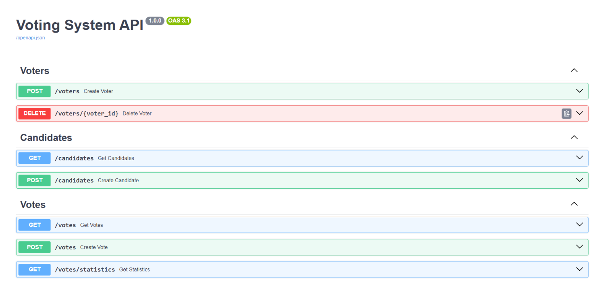
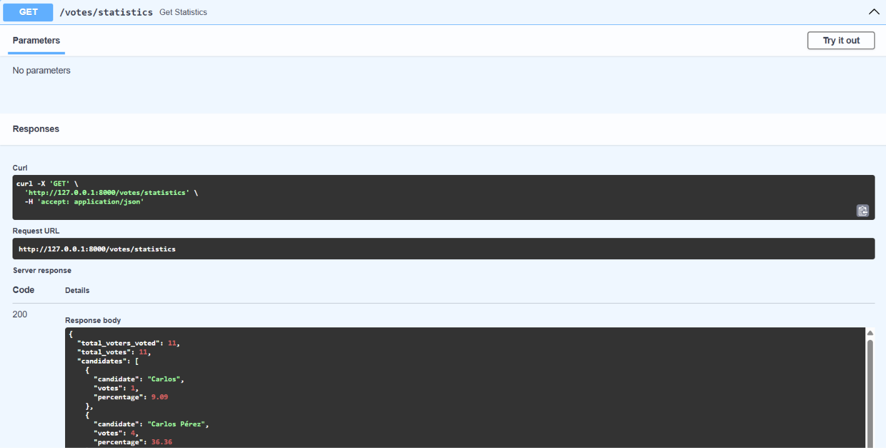
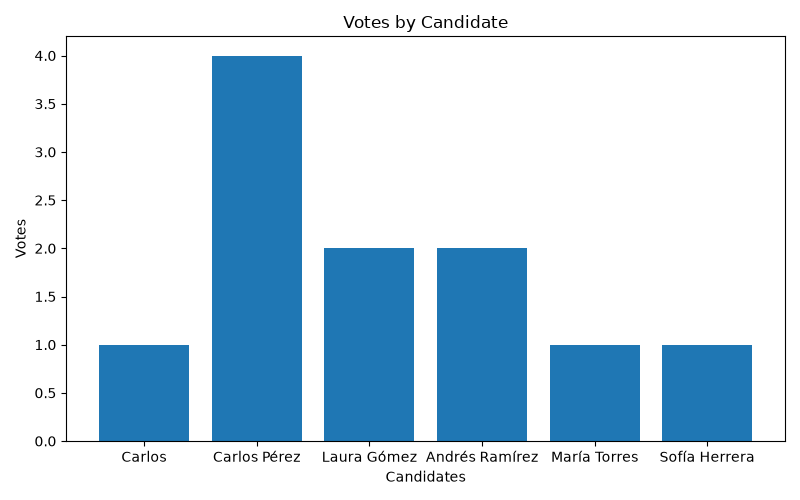

#  Voting System API

API RESTful desarrollada con **FastAPI** para gestionar un sistema de votaciones. Permite registrar votantes y candidatos, emitir votos garantizando que cada votante vote una única vez y generar estadísticas con una gráfica de los resultados utilizando **Pandas** y **Matplotlib**.

---

#  Tecnologías utilizadas

- Python 3.x
- FastAPI
- SQLAlchemy
- MySQL
- Pydantic
- Pandas
- Matplotlib
- Uvicorn

---

#  Arquitectura del proyecto

El proyecto está organizado siguiendo una arquitectura por capas para separar responsabilidades y facilitar el mantenimiento del código.

```text
app/
│
├── models/          # Modelos de SQLAlchemy
├── schemas/         # Esquemas de Pydantic
├── repositories/    # Acceso a la base de datos
├── services/        # Lógica de negocio
├── routes/          # Endpoints de la API
│
├── database.py
└── main.py
```

### Models

Representan las tablas de la base de datos mediante SQLAlchemy.

### Schemas

Definen la validación de las solicitudes y respuestas utilizando Pydantic.

### Repositories

Contienen únicamente el acceso a la base de datos.

### Services

Implementan toda la lógica del negocio, validaciones y manejo de transacciones.

### Routes

Exponen los endpoints de la API y delegan el procesamiento a los servicios.

---

#  Instalación

## 1. Clonar el repositorio

```bash
git clone https://github.com/Juan-Jose-Salazar/Voting-System.git

cd voting-system-api
```

---

## 2. Crear un entorno virtual

Windows

```bash
python -m venv venv
```

Activarlo

```bash
venv\Scripts\activate
```
---

## 3. Instalar dependencias

```bash
pip install -r requirements.txt
```

---

#  Configuración de MySQL

Crear una base de datos.

```sql
CREATE DATABASE voting_system;
```

---

Crear un archivo **.env**

```env
DB_HOST=localhost
DB_PORT=3306
DB_NAME=voting_system
DB_USER=root
DB_PASSWORD=tu_contraseña
```

---

#  Ejecutar el proyecto

```bash
uvicorn app.main:app --reload
```

La API estará disponible en

```
http://localhost:8000
```

Swagger

```
http://localhost:8000/docs
```

ReDoc

```
http://localhost:8000/redoc
```

---

#  Endpoints

## Votantes

| Método | Endpoint | Descripción |
|---------|----------|-------------|
| POST | /voters | Registrar un votante |
| DELETE | /voters/{id} | Eliminar un votante |

---

## Candidatos

| Método | Endpoint | Descripción |
|---------|----------|-------------|
| POST | /candidates | Registrar un candidato |
| GET | /candidates | Obtener candidatos |

---

## Votos

| Método | Endpoint | Descripción |
|---------|----------|-------------|
| POST | /votes | Emitir un voto |
| GET | /votes | Obtener todos los votos |
| GET | /votes/statistics | Obtener estadísticas de la votación |

---

#  Ejemplos de uso

## Registrar un votante

POST /voters

```json
{
    "name": "Juan Salazar",
    "email": "juan@gmail.com"
}
```
```json

{
  "name": "Pedro López",
  "email": "pedro2@gmail.com"
}

```
```json
{
  "name": "Ana Martínez",
  "email": "ana3@gmail.com"
}
```
```json
{
  "name": "Camilo Ruiz",
  "email": "camilo4@gmail.com"
}
```
```json
{
  "name": "Luisa Díaz",
  "email": "luisa5@gmail.com"
}
```


---

## Registrar un candidato

POST /candidates

```json
{
    "name": "Carlos Pérez",
    "party": "Partido Verde"
}
```
```json
{
  "name": "Laura Gómez",
  "party": "Movimiento Ciudadano"
}

```

---

## Emitir un voto

POST /votes

```json
{
    "voter_id": 1,
    "candidate_id": 1
}
```
```json
{
    "voter_id": 2,
    "candidate_id": 1
}
```

```json
{
    "voter_id": 3,
    "candidate_id": 1
}
```
```json
{
    "voter_id": 4,
    "candidate_id": 2
}
```
```json
{
    "voter_id": 5,
    "candidate_id": 2
}
```

---

#  Estadísticas

El endpoint

```
GET /votes/statistics
```

retorna:

- Total de votos por candidato.
- Porcentaje de votos por candidato.
- Total de votantes que han votado.
- Ruta donde se almacena la gráfica generada.

Ejemplo de respuesta:

```json
{
    "total_voters_voted": 12,
    "total_votes": 12,
    "candidates": [
        {
            "candidate": "Carlos Pérez",
            "votes": 5,
            "percentage": 41.67
        },
        {
            "candidate": "Laura Gómez",
            "votes": 3,
            "percentage": 25.00
        }
    ],
    "chart_path": "charts/votes_chart.png"
}
```

---

#  Capturas

## Swagger





---

## Estadísticas





---

## Gráfica generada





---

#  Validaciones implementadas

- Un votante no puede votar más de una vez.
- No se permite registrar dos votantes con el mismo correo electrónico.
- Un votante no puede registrarse como candidato y viceversa.
- Se valida la existencia del candidato antes de emitir un voto.
- El campo **has_voted** se actualiza automáticamente.
- El contador de votos del candidato se incrementa automáticamente.

---

#  Autor

Juan José Salazar Aristizábal

Prueba técnica para Practicante Desarrollador de Software.
